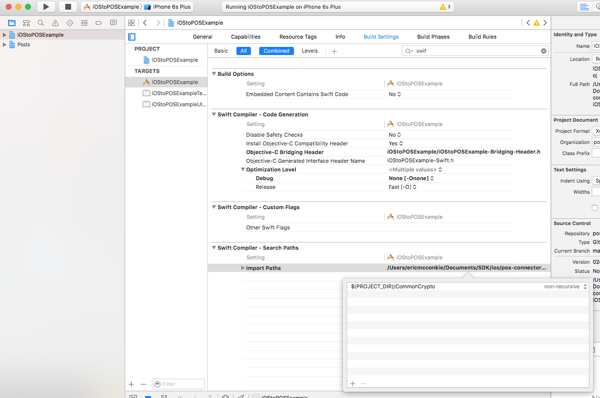

# pos-connector-ios-sdk-sample
Sample demonstrating the usage of Poynt POS Connector SDK for iOS

#Known issues, and (possible) resolutions

* <del>Amplitude (this will go away, but necessary for now)
* XCode with iOS Simulator or correct path for CommonCrypto - see `{projectdir}/CommonCrypto/module.map`
* CommonCrypto import to project - `Build Settings-> Swift Compilier Build Paths -> Import Paths` add `$(PROJECT_DIR)/CommonCrypto`

