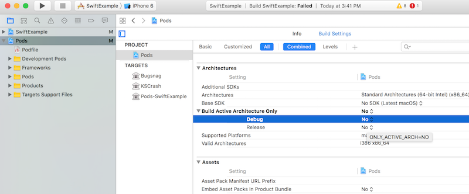

# PoyntLib

The Example directory contains SwiftExample and Example_objc. The Objective C sample only has the pairing flow. The Swift sample is more complete and contains payment examples.

## Example

To run the example project, clone the repo, and run `pod install` from the Example/Example_objc or Example/SwiftExample directory first. In Xcode open .xcworkspace file in the correspoding directory.

## Requirements

## Installation

Currently the PoyntLib SDK is only available through local [CocoaPods](http://cocoapods.org) installation. To install
it, download (clone, submodule or however you like) this repo and add to your Podfile:

```ruby
pod 'PoyntLib', :path => 'path/to/PoyntLib.podspec'
```

If you are using swift, don't forget to create a Bridge header:

```
#ifndef Bridge_h
#define Bridge_h
	#import "PoyntLib.h"
#endif /* Bridge_h */

```
To build and run the SwiftSample you may need to set the **Debug** option to **No** in Build Settings.



Checkout the included sample files to see implementations.

## License

PoyntLib is available under the MIT license. See the LICENSE file for more info.
